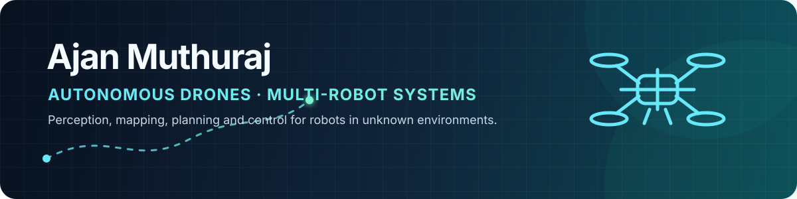

  

  
  
  

## Hello — I'm Ajan

I'm a **robotics and autonomous-systems engineer** and a Mechanical Engineering
graduate from **IIT Madras**. I enjoy connecting control, motion planning,
perception, simulation, and embedded hardware into systems that work as a
whole.

- Building autonomous drone workflows with **Isaac Sim, ArduPilot, ROS 2, 3D SLAM, and Docker**
- Interested in **multi-robot systems, exploration, reinforcement learning, and motion planning**
- Member of the IIT Madras team that placed **second in the
  [2025–2026 Swarm Rescue Challenge final](https://www.ip-paris.fr/en/news/swarm-rescue-challenge-final-2025-2026-save-lives-controlling-swarm-drones)**
- Joining **Dai-ichi Life Techno Cross (DLTX), Japan** as a Systems Engineer

## Featured engineering work

| Project | What it demonstrates |
|---|---|
| **[Isaac Sim Autonomous Drone Stack](https://github.com/AjanM27/isaac-sim-drone-autonomy)** | A reproducible quadrotor platform connecting Isaac Sim, ArduPilot SITL, MAVROS, ROS 2 Jazzy, Ouster 3D LiDAR, RTAB-Map, frontier exploration, PID optimization, and multi-drone experiments. |
| **[Dynamic Path Planning with Adaptive RRT*](https://github.com/AjanM27/Dynamic-Path-Planning-with-Adaptive-RRT-)** | Real-time replanning around static and moving obstacles, with RRT*, A*, Adaptive A*, and LPA* comparisons. |
| **[Multi-Robot SLAM Navigation](https://github.com/AjanM27/Multi-Robot-SLAM-Navigation)** | Shared occupancy-grid mapping, decentralized flocking, deadlock recovery, and noise-robust coordination for robot swarms. |
| **[RL-Based Swarm Navigation](https://github.com/AjanM27/Swarm_RL_InterIIT)** | A ROS 2 and Gazebo multi-robot workflow combining reinforcement learning, visualization, and task-assignment interfaces. |

## Technical toolkit

  
  &nbsp;&nbsp;
  
  &nbsp;&nbsp;
  
  &nbsp;&nbsp;
  
  &nbsp;&nbsp;
  
  &nbsp;&nbsp;
  
  &nbsp;&nbsp;
  
  &nbsp;&nbsp;
  
  &nbsp;&nbsp;
  

  
  
  
  
  
  

| Area | Experience |
|---|---|
| **Robotics & autonomy** | ROS 2, MAVROS, Gazebo, Isaac Sim, RViz, TF, SLAM, autonomous navigation |
| **Planning & control** | RRT/RRT*, A*, frontier exploration, PID control, state estimation |
| **Learning & perception** | Reinforcement learning, PyTorch, OpenCV, NLP/NER, LiDAR and RGB-D sensing |
| **Programming** | Python, C++, MATLAB, Bash, TypeScript |
| **Systems & hardware** | Linux, Docker, Git/GitHub, Arduino, ESP32, IMU, LiDAR |

## A little more about me

My work spans simulation and real hardware—from a gesture-controlled rover and
ESP32 communication projects to multi-agent navigation and autonomous drones.
I care about reproducibility, measurable behavior, and making complex robotics
stacks understandable enough for another engineer to continue the work.

  <b>Open to conversations about robotics, autonomy, simulation, and multi-agent systems.</b> 
  <a href="mailto:ajanm2003@gmail.com">Email</a> ·
  <a href="https://www.linkedin.com/in/ajanmuthuraj/">LinkedIn</a> ·
  <a href="https://github.com/AjanM27?tab=repositories">All repositories</a>

