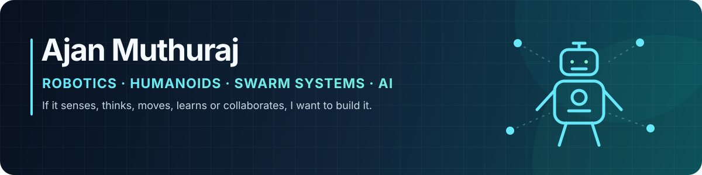

  

  
  
  
  

<h2 align="center">Anything and everything robotics.</h2>

  Humanoids · Swarm robotics · AI &amp; computer vision · Autonomy · Control · Embedded systems

## Robotics, end to end

I am interested in robotics as a whole. If a system can **sense, reason, move,
learn, or collaborate**, I want to be involved in building it—from algorithms
and simulation to electronics and real hardware.

I am especially drawn to **humanoid robots** and **swarm intelligence**, while
my project work also spans autonomous navigation, AI, computer vision, control,
SLAM, reinforcement learning, and embedded systems.

## What I work across

| Humanoids & embodied systems | Swarms & multi-robot | AI & perception | Robot engineering |
|---|---|---|---|
| Locomotion and manipulation | Coordination and task allocation | Computer vision and learning | Simulation and control |
| Human-robot interaction | Shared mapping and planning | Reinforcement learning | Embedded systems and sensing |
| Embodied intelligence | Decentralized autonomy | State estimation and SLAM | Prototyping and deployment |

## Core toolkit

  
  
  
  
  
  
  
  
  
  
  
  
  
  
  

