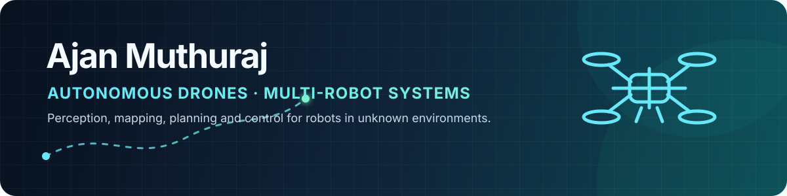

  

  
  
  

<h2 align="center">I build autonomous robots that explore, map, and coordinate.</h2>

  Robotics and autonomous-systems engineer · Mechanical Engineering graduate, IIT Madras

## Engineering north star

My long-term goal is to build **teams of aerial robots for search and rescue in
unknown environments**—systems that can perceive in 3D, build and share maps,
plan safely, coordinate under limited compute and communication, and transfer
reliably from simulation to real hardware.

<pre>
SENSING  →  STATE ESTIMATION  →  3D MAPPING  →  SAFE PLANNING  →  FLIGHT CONTROL
                                       ↕
                         MULTI-ROBOT COORDINATION
</pre>

Today, I am working toward that goal through autonomous-drone simulation,
flight-control integration, 3D SLAM, exploration, controller optimization, and
multi-drone experiments.

## Flagship project

### [Isaac Sim Autonomous Drone Stack](https://github.com/AjanM27/isaac-sim-drone-autonomy)

A reproducible autonomy platform connecting **NVIDIA Isaac Sim, ArduPilot SITL,
MAVROS, ROS 2 Jazzy, Ouster 3D LiDAR, RTAB-Map, and Docker**.

| Capability | Implemented system |
|---|---|
| **Flight** | ArduPilot cascaded control, tuned hover/braking, camera-relative teleoperation |
| **Perception** | RGB, IMU, upward/downward ToF, and Ouster OS1 3D LiDAR |
| **Mapping** | Point-to-plane ICP odometry and probabilistic 3D OctoMap |
| **Exploration** | Collision-aware 3D frontier planning, replanning, return-home, and landing |
| **Scale** | Multi-drone physics scenes, fleet demonstrations, and autonomous PID optimization |
| **Reproducibility** | One-command Ubuntu setup, containers, checksummed offline assets, CI, and benchmarks |

> Current direction: efficient multi-drone exploration, map sharing, and
> learning-based decision-making in previously unseen environments.

## Focus areas

| Autonomy | Spatial intelligence | Multi-robot systems | Sim-to-real |
|---|---|---|---|
| Motion planning | LiDAR perception | Shared mapping | Physics-based simulation |
| Flight control | 3D SLAM | Task allocation | Reproducible deployment |
| Frontier exploration | State estimation | Swarm coordination | Hardware integration |
| Reinforcement learning | Occupancy mapping | Communication-aware autonomy | Validation and benchmarking |

## Selected work

| Project | Engineering contribution |
|---|---|
| **[Dynamic Path Planning with Adaptive RRT*](https://github.com/AjanM27/Dynamic-Path-Planning-with-Adaptive-RRT-)** | Real-time replanning around static and moving obstacles, with RRT*, A*, Adaptive A*, and LPA* comparisons. |
| **[Multi-Robot SLAM Navigation](https://github.com/AjanM27/Multi-Robot-SLAM-Navigation)** | Shared occupancy-grid mapping, decentralized flocking, deadlock recovery, and noise-robust swarm coordination. |
| **[RL-Based Swarm Navigation](https://github.com/AjanM27/Swarm_RL_InterIIT)** | A ROS 2 and Gazebo workflow combining reinforcement learning, multi-robot simulation, visualization, and task assignment. |
| **[Gesture-Controlled Defence Rover](https://github.com/AjanM27/Gesture-Controlled-Defence-Rover)** | An embedded robotics prototype integrating gesture sensing, wireless communication, mobile control, and a robotic arm. |

## Technical foundation

  
  &nbsp;&nbsp;
  
  &nbsp;&nbsp;
  
  &nbsp;&nbsp;
  
  &nbsp;&nbsp;
  
  &nbsp;&nbsp;
  
  &nbsp;&nbsp;
  
  &nbsp;&nbsp;
  
  &nbsp;&nbsp;
  

  
  
  
  
  
  

**Robotics:** ROS 2, MAVROS, RViz, TF, Gazebo, Isaac Sim, ArduPilot, RTAB-Map 
**Algorithms:** RRT/RRT*, A*, frontier exploration, PID control, SLAM, reinforcement learning 
**Engineering:** Python, C++, MATLAB, Bash, Linux, Docker, Git/GitHub, Arduino, ESP32

## Background

- **B.Tech, Mechanical Engineering** — Indian Institute of Technology Madras
- Member of the IIT Madras team that placed **second in the
  [2025–2026 Swarm Rescue Challenge final](https://www.ip-paris.fr/en/news/swarm-rescue-challenge-final-2025-2026-save-lives-controlling-swarm-drones)**
- Upcoming **Systems Engineer** at Dai-ichi Life Techno Cross (DLTX), Japan

  <b>Interested in robotics, autonomy, simulation, and multi-agent systems?</b> 
  <a href="mailto:ajanm2003@gmail.com">Email</a> ·
  <a href="https://www.linkedin.com/in/ajanmuthuraj/">LinkedIn</a> ·
  <a href="https://github.com/AjanM27?tab=repositories">All repositories</a>

